# INSURANCE ALL COMPANY - RANKING CLASSIFICATION PROJECT

  
  
  

_A demonstração detalhada do código pode ser encontrada [neste link.](https://github.com/AndreMenezesDS/PA004_health_insurance/blob/92736f1f26bbcea4a8e196e28258d2167bb19902/PA004_notebook.ipynb)_

# 1.0. RESUMO

___

Insurance All Co. é uma empresa que trabalha com venda de assinaturas referentes à planos de seguridade, com especialização no setor da saúde.
Um seguro de saúde é um contrato o qual a empresa se compromete a prover compensações financeiras em casos de doenças, dano específico ou morte por parte do contratante, sob o retorno do pagamento de um prêmio pré-especificado. Esse prêmio é a soma em dinheiro que o cliente deve pagar regularmente para a empresa para ter direito ao serviço.
Visando aumentar a rentabilidade do serviço e a fidelidade de adesão de seus clientes, a empresa analisa a possibilidade de oferecer um novo produto: A _venda cruzada (cross-selling)_ dos seguros de saúde já ofertados em conjunto com a aquisição de planos de seguridade de automóvel, motivando a contratação de um cientista de dados para auxiliar o time de negócios no curso da implementação dessa nova proposta.

__*Este é um projeto fictício. A empresa, o contexto e as perguntas de negócios não são reais.__

# 2.0 METODOLOGIA

___

A criação desse projeto se deu com base no processo produtivo _CRISP-DM (Cross Industry Standard Proccess to Data Mining)_, que refere-se à aplicação de um modelo cíclico para o curso de desenvolvimento e entrega do modelo de _aprendizagem de máquina (Machine Learning)_ posto em produção.
A adoção deste modelo nos permite rapidez na entrega de valor bem como uma estruturação sólida para a tomada de decisões, garantindo a evolução nos resultados observados a cada ciclo.

Cada fase do método cíclico é detalhada nas seções:

* [Compreensão do Problema de Negócio](#3-PROBLEMA-DE-NEGÓCIO)
* [Compreensão dos Dados](#4-DESCRIÇÃO-DE-DADOS)
* [Preparação dos Dados](#5-PREPARAÇÃO-DOS-DADOS)
* [Modelagem dos Dados](#6-MODELAGEM-DOS-DADOS)
* [Avaliação dos Resultados](#7-AVALIAÇÃO-DOS-RESULTADOS)
* [Aplicação do Modelo em Produção](#8-APLICAÇÃO-DO-MODELO-EM-PRODUÇÃO)

# 3.0. PROBLEMA DE NEGÓCIO

____

## 3.1 Descrição do Problema

A empresa, em vias de expandir seu ramo de atuação, tomou a decisão de oferecer a venda cruzada de um novo produto: seguro veícular. Para estudar a viabilidade dessa proposta, a companhia conduziu pesquisas com seus clientes que contrataram o seguro de saúde, armazendo os dados obtidos em servidor particular.

O time de negócios irá trabalhar de acordo com uma estratégia de otimização sobre à oferta do novo produto (Seguro de automóvel) para os atuais clientes detentores de seguro de saúde.
Este processo será feito mediante os insights obtidos da análise dos perfis/comportamentos observados nos dados das pessoas presentes no banco da empresa, direcionados através da resposta às seguintes perguntas de negócio:

- Quais os insights obtidos dos atributos mais relevantes das pessoas que demonstram maior interesse na aquisição de seguro veícular?

- Qual o percentual de clientes interessados na aquisição do seguro veícular, dada restrição de 20000 ligações para entrar em contato?

- Quantas ligações o time de negócios deverá fazer para atingir 80% dos interessados? 

- Se o limite de ligações for extendido para 40000, qual será o percentual de clientes interessados contatados?

## 3.2 Proposta de Solução

Dado o problema de negócio, eu (Cientista de Dados) propus uma solução: Retornar à empresa um modelo de aprendizado de máquina capaz de realizar previsões acerca das intenções de aquisição casada para cada cliente do Banco de Dados.

É importante notar que devido à restrição imposta pelo time de negócios (20000 ligações), mais importante que a predição binária quando do interesse de aquisição do seguro veícular (Interessados/Não Interessados) é a **probabilidade** de dado cliente demonstrar interesse de compra.
Sabendo dessa particularidade do problema, construí um modelo que retorna esse valor de probabilidade (entre 0 e 1)  de forma a utilizá-los como pontuação (score) para cada cliente visando a ordenação da base de dados um **ranking**, que garantirá melhor aproveitamento em conversões quando da realização dos primeiros contatos para venda casada de seguros.

Finalmente, como forma de visualização da aplicação do modelo treinado à uma base de dados qualquer, implementei sua funcionalidade de predição através da customização de interface do Google Sheets, com a criação de um botão responsável por fazer a requisição da execução do modelo em produção via web.
A imagem a seguir mostra a simplicidade de funcionamento da aplicação:

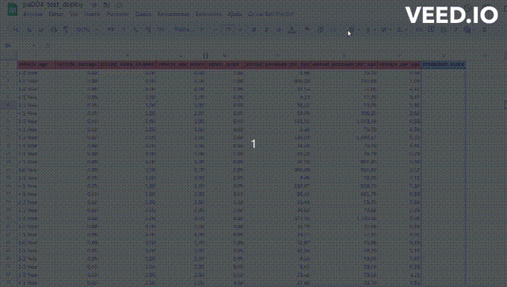

## 3.3 Premissas de Negócio

* Clientes que possuem seguro de saúde podem ter interesse na compra casada com um seguro automotivo.
* A prática de venda cruzada aumenta a fidelidade cliente-empresa.
* A aprendizagem obtida pela venda cruzada pode tornar-se uma estratégia horizontal para a empresa em seu mercado atuante.
* Um modelo de aprendizagem de máquina _(Machine Learning)_ de rankeamento de clientes mais prováveis a aquisição de seguro veícular vai otimizar o rendimento do time de negócios de forma a viabilizar a entrada da empresa nesse novo setor.

# 4.0. DESCRIÇÃO DOS DADOS

___

O conjunto de dados que representam o contexto foi disponibilizado em servidor privado, cuja consulta SQL encontra-se na seção '0.3 Database Connections' do notebook disponibilizado: [Health Insurance Cross-Sell](!https://github.com/AndreMenezesDS/PA004_health_insurance/blob/92736f1f26bbcea4a8e196e28258d2167bb19902/PA004_notebook.ipynb)

## 4.1. Dimensão dos Dados

Esse conjunto de dados contém inicialmente informações de cadastro de **381109 clientes (linhas)** de acordo com **12 características individuais (colunas)**. Serão estes os dados usados para o desenvolvimento das hipóteses de projeto.

## 4.2 Descrição dos Atributos

| Atributos             | Significado|
| --------------------- | ------------------------------------------------- |
| id                    | Numeração única de identificação de cada cliente  |
| gender                | Gênero de cada cliente  |
| age                   | Idade do cliente  |
| driving_license       | Indicador binário de posse de licença de direção: '0' indica clientes não licenciados, '1' indica clientes licenciados  |
| region_code           | Código de região do cliente  |
| previously_insured    | Indicador binário de ativação prévia do seguro de saúde: '0' indica nenhuma ativação prévia, '1' indica ativação prévia  |
| vehicle_age           | Idade do veículo de posse do cliente |
| vehicle_damage        | Indicador binário de ocorrência de danos no veículo: '0' indica veículos não danificados, '1' indica veículos danificados  |
| annual_premium        | Premiação anual (em rúpias paquistanesas) paga pelo cliente para a obtenção de seguro de saúde |
| policy_sales_channel  | Código anónimo referente ao meio de contato com o cliente (Exemplos: Email, telefone, pessoalmente, etc) |
| vintage               | Número de dias em que o cliente esteve associado à empresa de seguro de saúde. |
| response              | **Váriavel Classe(resposta)**, servindo como indicador binário da demonstração de interesse à aquisição de seguro veícular: '0' não indica interesse de compra, '1' indica interesse de compra.  |

* Nota-se que a origem desse banco de dados possui a particularidade da localização do valor monetário em moeda paquistanesa; não será feita nenhuma alteração/localização de valor uma vez que isso não impacta no problema/solução de negócio.

### 4.2.1 Tipos de Dados

  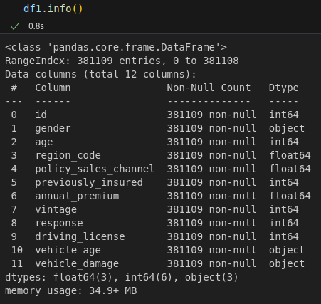
  

Os dados do dataframe original compreendem majoritariamente 2 tipos númericos: int64 e float64. Nota-se que os dados nominais (Ex: Colunas 'gender', 'vehicle_age', 'vehicle_damage') serão posteriormente tratadas pelas premissas de negócio, com aplicação de processos de encoding caso necessário.
Também é importante observar que não há valores nulos ou ruído dentre os dados registrados.

## 4.3. Alterações nos tipos de dados

Em uma observação inicial da formatação dos dados, optou-se alterar os tipos de 'region_code' e 'policy_sales_channel' para tipo númerico inteiro(int64) para melhor visualização, uma vez que não há qualquer entrada com valores fracionados.
Dos dados categóricos(object), foi realizada a alteração de 'vehicle_damage' para inteiro(int64), conforme previsto na descrição feita anteriormente.

  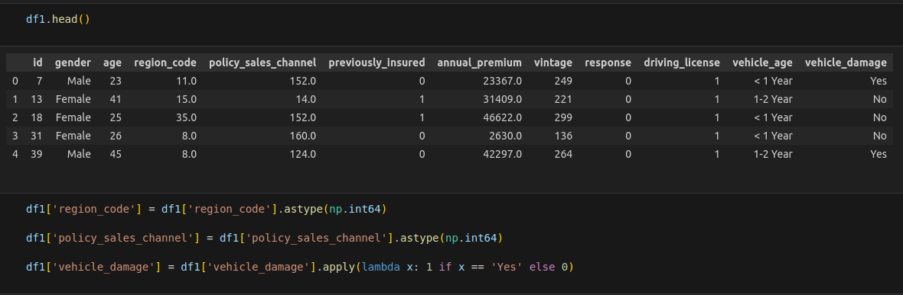
  

## 4.4 Análise Preliminar

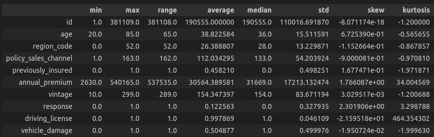

Diante da visão geral da distribuição dos **dados numéricos**, destacam-se:

*   As variáveis binárias ('previously_insured' e 'vehicle_damage') apresentam valores médios próximos a 0.5, indicando o balanceamento de quantidade entre as classes presentes. 
*   Diferentemente do item anterior, a variável binária 'driving_license' apresenta valor médio próximo a 1.0, indicando a quase unanimidade de pessoas com licença de motorista em toda nossa base de dados. Essa desproporção exagerada pode culminar no **vazamento de dados** ao relacionar essa variável a nossa váriavel resposta, motivando assim a **exclusão** da consideração dessa característica nas análises posteriores.
*   O número máximo de dias vigentes de contrato de um cliente com a empresa é de 299 dias, indicando que todas as pessoas de nossa base de dados adquiriram o serviço da empresa recentemente, no período que compreende o ano presente.
*   O valor médio de nossa variável resposta é de 0.12, indicando um forte **desbalanceamento** na nossa base de dados que aponta para uma vasta maioria de pessoas não interessadas na aquisição de compra de seguro veícular.

Para os **dados categóricos** ('gender', 'vehicle_age'), não foram observadas diferenças notáveis na proporção entre as categorias.

## 4.5 Principais Insights Obtidos

Aqui, estão listadas as hipóteses que resultaram em maior ganho de informação ao problema em estudo. 
Para maior detalhamento de toda a análise exploratória de dados (EDA), confira o [notebook do projeto.](!https://github.com/AndreMenezesDS/PA004_health_insurance/blob/92736f1f26bbcea4a8e196e28258d2167bb19902/PA004_notebook.ipynb)

**Hipótese 1: Clientes mais velhos são apróximadamente 10% mais propensos a aquisição de seguro veícular.**
_Verdadeiro: Há maior proporção de clientes entre 40~50 anos de idade que demonstram interesse na aquisição de seguro veícular._

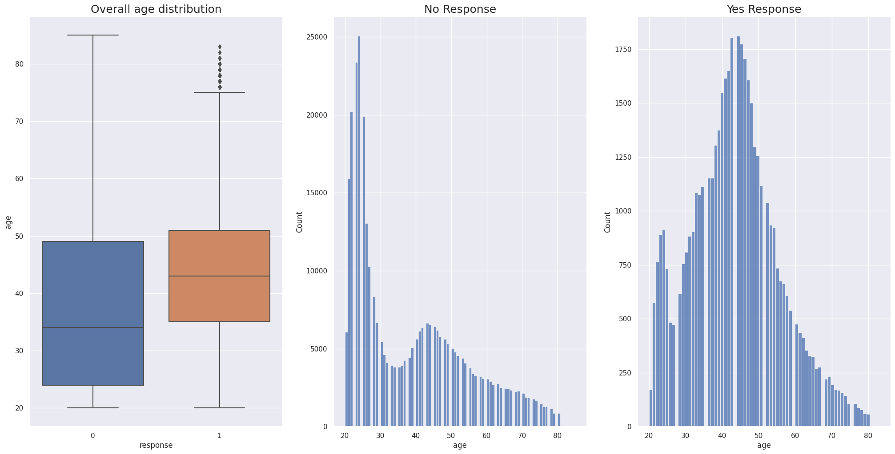

**Hipótese 6: Clientes com veículos mais velhos são 10% mais propensos a adquirir seguro veícular.**
_Verdadeiro: Clientes com veículos mais velhos apresentam, proporcionalmente, maior interesse na aquisição de seguro veícular._

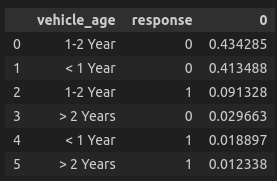

**Hipótese 7: Clientes que apresentam veículo danificado são 10% mais propensos a aquisição de um seguro veícular.**
_Verdadeiro: Clientes com veículos danificados apresentam, proporcionalmente, maior interesse na aquisição de seguro veícular._

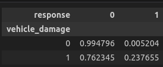

**Hipótese 9: Clientes de uma determinada região são 10% mais propensos a adquirir seguro veícular.**
_Verdadeiro: Alguns códigos de região apresentam proporções muito maiores de clientes interessados._

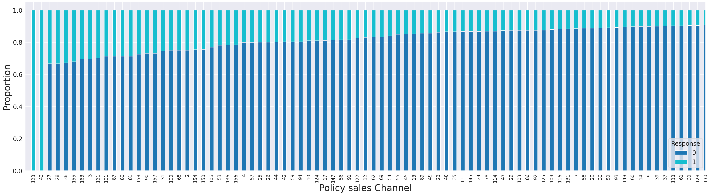
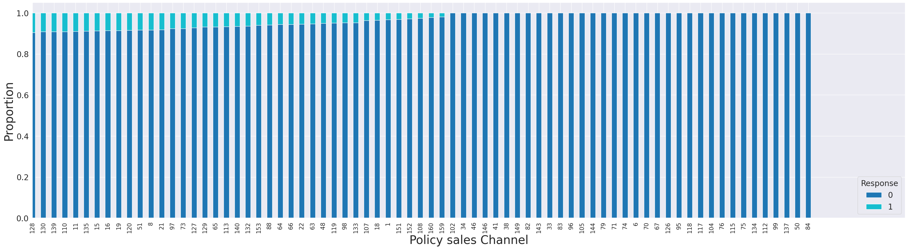

## 4.6 Resultados Finais da Análise exploratória de Dados

### 4.6.1 Engenharia de Dados (Criação de novas váriaveis)

Foram criados novos atributos previsores (features) a partir da combinação de váriaveis existentes, de forma a procurar padrões de correlação com interesse de compra para features que apresentaram pouca relevância na Análise Exploratória inicial dos dados.
Essas features, obtidos através da divisão de um valor pelo outro foram: _'annual_premium_per_day', 'annual_premium_per_age', 'vintage_per_age'_.

Também foram criados features através do estabelecimento de uma pontuação as classes existentes em cada váriavel conforme suas proporções de pessoas interessadas na compra de veículos.
Essas features são: _'scored_sales_channel'_ (Relaciona os canais de contato com maior proporção de interessados), _'region_score'_ (Relaciona regiões(código) com maior proporção de interessados) e _'vehicle_age'_(Atribui maior peso à idade de veículos que possuem maior proporção de interessados)

* Maiores detalhes sobre a criação de cada feature podem ser vistos no [notebook do projeto.](!!https://github.com/AndreMenezesDS/PA004_health_insurance/blob/92736f1f26bbcea4a8e196e28258d2167bb19902/PA004_notebook.ipynb)

### 4.6.2 Análise Multivariada de Dados

O resultado final da análise de correlação das variáveis entre si e a variável resposta é dado pelo diagrama de dispersão.

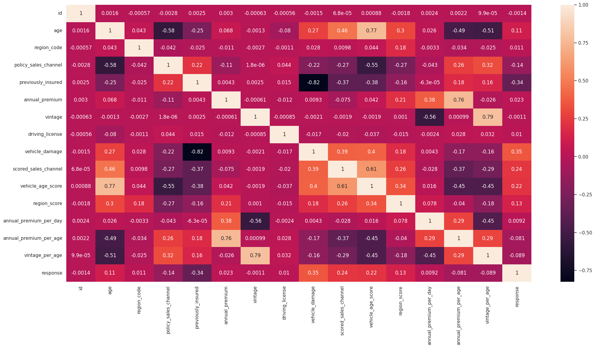

* Pela análise multivariada, conclui-se que as features envolvendo pontuação apresentaram maior correlação com a variável resposta em relação às demais.

# 5.0. PREPARAÇÃO DOS DADOS
____

## 5.1 Separação dos dados (Treino/Teste)

De forma a viabilizar o aprendizado do algoritmo e sua subsequente testagem para capacidade de generalização, foi adotado um percentual de 20% (76222 amostras) dos dados originais como sendo dados teste; os 80% restantes (304888 amostras) portanto, destinados ao treinamento do modelo.

## 5.2 Pré Processamento

A maioria de modelos de aprendizagem de máquina exigem a preparação prévia dos dados de forma que os modelos possam trabalhar de acordos com seus padrões pré-determinados. Variáveis contínuas devem possuir uma distruibuição tão próxima da normal quanto for possível, e variáveis categóricas representadas por texto devem ser substituídas por números.
Existem muitas formas de pré processamento de dados, tais como padronização (_standardization_), reescala(_reescaling_) e codificação(_encoding_). Para as variáveis de nossa base de dados, foram adotadas as seguintes técnicas:

* annual_premium, annual_premium_per_day, annual_premium_per_age: [Standard Scaler](!https://scikit-learn.org/stable/modules/generated/sklearn.preprocessing.StandardScaler.html)
* age, vintage, vintage_per_age: [Reescaling/MinMaxScaler](!https://scikit-learn.org/stable/modules/generated/sklearn.preprocessing.MinMaxScaler.html)
* region_code: [Frequency Encoding](!https://datascience.stackexchange.com/questions/63749/why-does-frequency-encoding-work#:~:text=Frequency%20encoding%20is%20a%20widely,categorical%20features%20with%20high%20cardinality.)
* policy_sales_channel: [Mean Target Encoding](!https://scikit-learn.org/stable/modules/generated/sklearn.preprocessing.TargetEncoder.html)

## 5.3 Escolha Final das Variáveis para Aplicação no Modelo

Paralelamente à análise feita via Análise Exploratória de Dados (EDA), foram aplicadas todas as variáveis preditoras à um modelo de [Random Forest](!https://scikit-learn.org/stable/modules/generated/sklearn.ensemble.RandomForestClassifier.html) com o objetivo de obter quais os features servem como estimadores mais importantes para a classificação da propensão de compra de um cliente. 

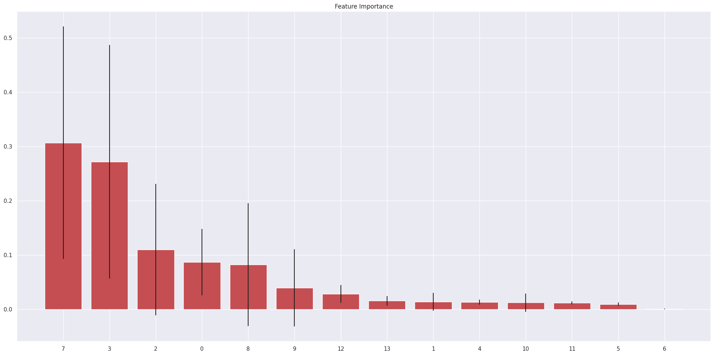

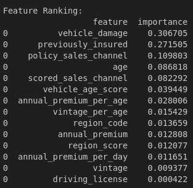

Os resultados da seleção de váriaveis foram:
* Via Análise Exploratória de Dados: age, vehicle_damage, policy_sales_channel, scored_sales_channel, region_score, vehicle_age_score
* Via Random Forest: vehicle_damage, previously_insured, policy_sales_channel, age, scored_sales_channel, vehicle_age_score
* **TOTALIZANDO**: age, vehicle_age_score, vehicle_damage, previously_insured, policy_sales_channel, scored_sales_channel, region_score

Mais detalhes no [Notebook do projeto.](!!https://github.com/AndreMenezesDS/PA004_health_insurance/blob/92736f1f26bbcea4a8e196e28258d2167bb19902/PA004_notebook.ipynb)

# 6.0. MODELAGEM DOS DADOS
 ___
 
Foram testados 5 modelos de aprendizagem de máquina, lançando mão da técnica de validação cruzada (K-fold, k=4):

* Modelo base fícticio (base de comparação inicial, afim de observar o resultado obtido quando da não aplicação de um modelo - escolha e realização de clientes de modo aleatório)
* Modelo KNN
* Modelo de Regressão Logística
* Modelo XGBoost
* Modelo LGB

Os modelos de KNN e Regressão Logística foram realizados de forma a obter entendimento do comportamento do fênomeno estudado em um rankeamento para classificação binária. Adiante, comparou-se modelos baseados em florestas de decisão(XGBoost e LGBM) para obtenção dos melhores resultados considerando a posição 20000 do rankeamento:

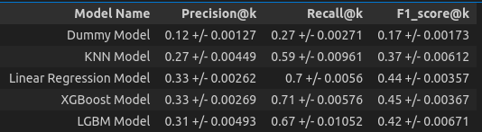

O modelo escolhido por apresentar as melhores métricas de interesse (Recall@k e F1_score@k) foi o XGBoost.

# 7.0. AVALIAÇÃO DOS RESULTADOS
 ___
 
 ## 7.1 Resultados Gerais
 
 Após o processo de tunning dos parâmetros, os resultados foram (para posição k=20000 em ranking):
 

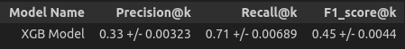

* Curva de Ganho Cumulativo

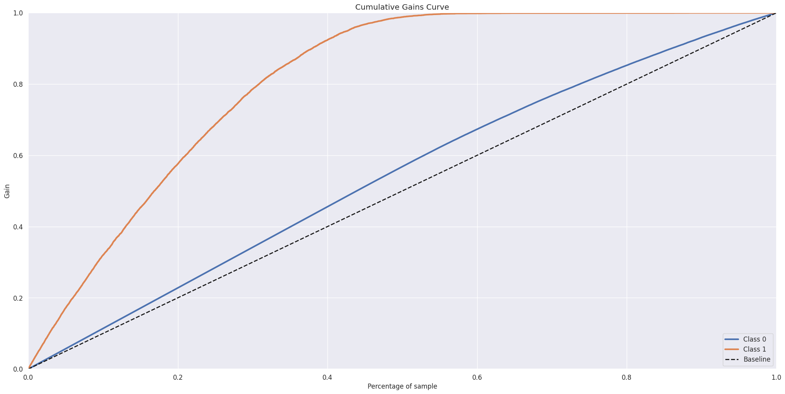

A curva de ganho cumulativo mostra a relação entre a porcentagem de amostras recuperadas de uma determinada classe (eixo y) em relação a porcentagem total do número de amostras (eixo x). Dessa forma, numa situação ideal,o quão mais próximo a curva se aproxima do canto superior esquerdo do gráfico, melhor a eficiência do nosso algoritmo de rankeamento (maior parcela de clientes interessados contatados para menor número de ligações).
Pela análise do gráfico, podemos observar para nossos dados de teste (76222 amostras) e percentual total de base de aproximadamente 27% (20000 amostras), obtemos um ganho acumulado de aproximadamente 70% dentre os interessados na aquisição de seguro veícular.

* Curva de Elevação (Lift Curve)

")

A curva de elevação nos mostra uma comparação entre o modelo escolhido (XGBoost) e o modelo Fictício (Escolhas aleatórias) quanto ao rendimento de amostras interessadas recuperadas para dado percentual da base de dados. (Ex: lift = 2, indica que o modelo atual é 2x melhor que o modelo base de escolhas aleatórias)
De acordo com o observado para o nosso modelo, para um conjunto total de dados de teste com 76222 entradas, obtemos para 20000 amostras (27% da base) um rendimento de aproximadamente 2.6x melhor que o modelo de escolhas aleatórias.

* Curva de Retorno de Investimento (Curva ROI)

 

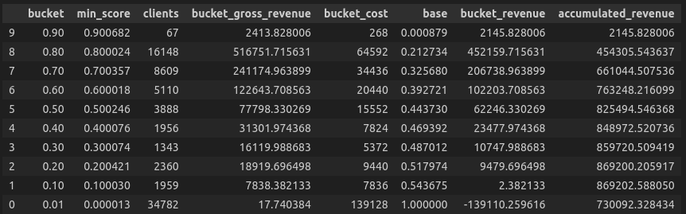
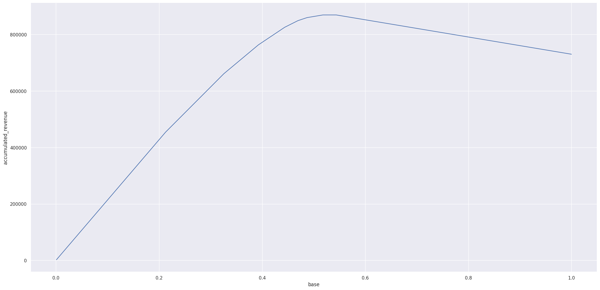

A curva de retorno de investimento é usada como estimativativa de rentabilidade para modelos de rankeamento/classificação: Com a definição inicial do custo de ligação ($4.00) e conversão média da venda de produto ($40.00), calcula-se o lucro acumulado usando a pontuação de propensão de compra (indicado na tabela acima como 'min_score') como pesos que multiplicam sobre o valor de conversão e do número de clientes. As seguintes conclusões podem ser tiradas da análise da curva ROI:

* Podemos dessa forma deduzir então que, para 20000 ligações, poderemos ter um retorno de investimento esperado de aproximadamente $550000.00; 
* Podemos também inferir que o ponto ótimo (máxima rentabilidade, com retorno de aproximadamente $869202.00) localiza-se nas dependências posição 41440(55% da base de dados de teste) do rankeamento retornado pelo modelo.

## 7.2 Respondendo as Perguntas de Negócio

Respondendo as perguntas de negócio propostas no início do projeto (ver seção [#3.0. PROBLEMA DE NEGÓCIO](#3-PROBLEMA-DE-NEGÓCIO)), temos:

### 7.2.1 Qual o percentual de clientes interessados na aquisição de seguro automotivo? O time de negócios será capaz de contata-los com as primeiras 20000 ligações?
*   Nossa base de dados de teste possui 76222 amostras, dos quais 9348 responderam ter interesse na aquisição de seguro veícular(response=1). Nosso modelo treinado foi capaz de recuperar um total de aproximadamente 6705 interessados, ou seja, 71,68% do total de interessados. (Recall@20000 = 71,68%)

### 7.2.2 Se o time de negócios for possibilitado de fazer 40000 ligações, qual será o percentual de clientes interessados na compra de seguro automotivo impactados?

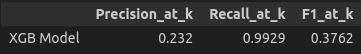

*   Para 40000 ligações, o modelo irá recuperar virtualmente todos os interessados (9261 dentre 9348 possíveis; Recall@40000 = 99.29%).

### 7.2.3 Quantas ligações serão necessárias para o time de negócios atingir 80% dos interessados?
*   Serão necessárias aproximadamente 23500 ligações.
 
# 8.0. APLICAÇÃO DO MODELO EM PRODUÇÃO
___

Para visualização dos resultados, optei pela escolha de uma ferramenta que pudesse ser facilmente integrada ao uso cotidiano do time de negócios: O Google Sheets.
Por se tratar de uma aplicação customizável que funciona em nuvem (portanto, não requerendo instalação prévia), fiz a implementação de um botão que efetua a previsão da propensão de compra para os dados em planilha, viabilizando posteriormente sua ordenação em um ranking.
Esse botão contém a funcionalidade responsável por fazer a requisição do modelo treinado posto em produção na web, servindo como uma API do projeto.

É importante notar como essa solução fornece grande escalabilidade ao time de negócios, impactando diretamente através de uma ferramente comumente utilizada, oferecendo até mesmo a possibilidade de ser usada como simulador em tempo real para testagem de previsões conforme alteração de valores das variáveis presentes.
O modelo pode ser acessado em:

- 	

 
# 9.0 CONSIDERAÇÕES FINAIS
___

A particularidade observada nesse problema de classificação reside no fato de seu resultado requerer métricas adequadas de análise para definir a qualidade do rankeamento, sendo portanto uma adaptação de métricas de classificação simples.
Dessa forma, todos os resultados são obtidos em função de uma posição @k das entradas de nossa base de dados. No problema, a métrica utilizada foi o top@k_recall, referente ao percentual da base recuperada pelo modelo até a posição 'k' determinada pelo usuário.

___

# 10.0 PRÓXIMOS PASSOS

___

- Testar outros algoritmos (Ex: Naive Bayes).
- Desenvolver/Implementar um dashboard que informe a performance do modelo e identificar seus gargalos de rendimento.

# 11.0 FERRAMENTAS E TÉCNICAS UTILIZADAS

___

-   Backend & Data Science:  , 
-   Apresentação & Frontend :  ,  ,  , 
-   SQL & Databases: 
-  Machine Learning & Análise de Dados:  ,  , ,  ,  ,  , 
-  WebAPI Hosting:  , 
- Editores & IDEs :  , 
- Versionamento de Código:  , 
- [Análise Exploratória de Dados](!https://www.ibm.com/br-pt/cloud/learn/exploratory-data-analysis)

# 12.0 CONTATOS

___

-  ou 
- 
- 

